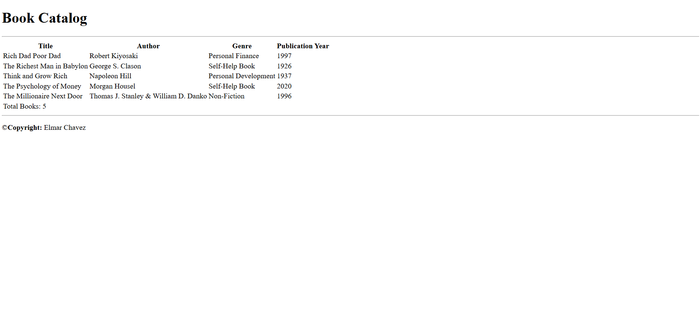

# 📁 Book Catalog Table

## ℹ️ A Simple HTML Table for Book Listings

This simple website displays a list of books along with their authors, genres, and publication years.

---

## 🔍 Overview

This project is a beginner-level exercise that uses pure HTML5 to present a catalog of books in a tabular format. It includes a semantic structure with a header, main content area, and footer. It demonstrates proper use of table-related elements like `<thead>`, `<tbody>`, and `<tfoot>`.

---

## ✨ Features

- Semantic HTML (`<header>`, `<main>`, `<footer>`)
- Tabular data structuring (`<table>`, `<thead>`, `<tbody>`, `<tfoot>`)
- Proper use of HTML metadata (`<meta>` tags)
- Clean document flow and sectioning
- Accessibility through proper structure

---

## 🧠 What I Learned

- How to structure a basic webpage using semantic HTML elements
- Creating and styling an HTML table for data presentation
- Using `<thead>`, `<tbody>`, and `<tfoot>` correctly for tabular data
- Writing accessible and valid HTML5 markup
- Using `meta` tags for better SEO and accessibility
- Keeping content organized using sectioning elements (`<header>`, `<main>`, `<footer>`)

---

## 🛠️ Tech Used

- HTML5

---

## 🚀 How to Run

1. Clone the repository
2. Navigate to this project folder
3. Open `Build a Book Catalog Table.html` in your browser

---

## 🌐 Live Demo

Or you can check out the 👉 [live website here](https://sample-projects-html5.netlify.app/pages/build%20a%20book%20catalog%20table/build%20a%20book%20catalog%20table)

---

## 🧑‍💻 Author

Created by **Elmar Chavez**

🗓️ Month/Year: **April 2025**

📚 Journey: **1st** month of learning _frontend web development_.
